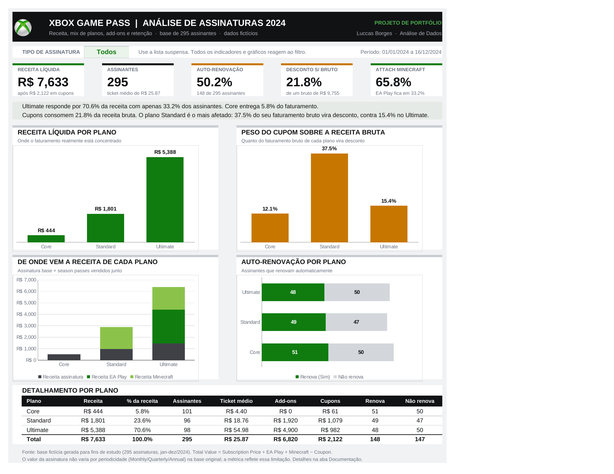

# Xbox Game Pass — Análise de Assinaturas 2024

Dashboard em Excel construído sobre uma base de 295 assinaturas do Xbox Game Pass, analisando composição de receita, peso dos descontos, origem do faturamento e retenção.

> **Dados fictícios.** A base foi gerada para fins de estudo e não representa números reais da Microsoft.



---

## O problema

Uma operação de assinatura com três planos (Core, Standard e Ultimate), dois add-ons opcionais (EA Play Season Pass e Minecraft Season Pass) e uma política de cupons em valor absoluto. A pergunta de fundo: **onde a receita realmente se forma e onde ela vaza.**

Quatro perguntas de negócio guiaram a análise:

1. Como a receita se distribui entre os planos?
2. Quanto os cupons consomem do faturamento bruto, e em qual plano o impacto é maior?
3. Quanto da receita de cada plano vem da assinatura base e quanto vem dos season passes?
4. Qual a taxa de auto-renovação e como ela varia entre os planos?

---

## Principais achados

### 1. A receita está concentrada em um plano

O Ultimate gera **70,6% da receita** (R$ 5.388 de R$ 7.633) com apenas 33% dos assinantes. O Core, que tem a maior base de clientes (101 de 295), entrega menos de 6% do faturamento.

| Plano | Assinantes | Receita líquida | % da receita | Ticket médio |
|---|---:|---:|---:|---:|
| Core | 101 | R$ 444 | 5,8% | R$ 4,40 |
| Standard | 96 | R$ 1.801 | 23,6% | R$ 18,76 |
| Ultimate | 98 | R$ 5.388 | 70,6% | R$ 54,98 |
| **Total** | **295** | **R$ 7.633** | **100%** | **R$ 25,87** |

Volume de clientes e volume de receita são distribuições diferentes. Uma leitura por número de assinantes sugeriria que os três planos têm peso parecido; por receita, o negócio é praticamente monoproduto.

### 2. O desconto se concentra no plano errado

Os cupons somam R$ 2.122 e consomem 21,8% da receita bruta. O número agregado esconde o ponto:

| Plano | Receita bruta | Cupons | % do bruto |
|---|---:|---:|---:|
| Core | R$ 505 | R$ 61 | 12,1% |
| Standard | R$ 2.880 | R$ 1.079 | **37,5%** |
| Ultimate | R$ 6.370 | R$ 982 | 15,4% |

**Mais de um terço do faturamento bruto do Standard vira desconto.** Como o cupom é concedido em valor absoluto e não em percentual, um mesmo desconto pesa de forma muito diferente conforme o ticket do plano. O Standard acabou no pior dos dois mundos: ticket baixo o suficiente para o cupom doer, volume alto o suficiente para o efeito escalar.

### 3. A assinatura base não é o produto

Separando a receita bruta por origem:

| Origem | Valor | % do bruto |
|---|---:|---:|
| Assinatura base | R$ 2.935 | 30,1% |
| EA Play Season Pass | R$ 2.940 | 30,1% |
| Minecraft Season Pass | R$ 3.880 | 39,8% |

**Quase 70% do faturamento bruto vem de add-ons.** No Ultimate a concentração é ainda maior: R$ 4.900 dos R$ 6.370 brutos (76,9%) vêm dos season passes. A assinatura em si funciona mais como porta de entrada do que como fonte de receita.

### 4. A retenção é um cara ou coroa, e não depende do plano

A auto-renovação está em 50,2% (148 de 295). A quebra por plano praticamente não varia: Core 50,5%, Standard 51,0%, Ultimate 49,0%.

Metade da base precisa ser reconquistada a cada ciclo, e nem o plano mais caro retém melhor. Isso desloca a hipótese: o gatilho de desativação não parece estar no preço nem no pacote.

---

## Recomendações

| Frente | Ação | Justificativa |
|---|---|---|
| Migração de plano | Priorizar campanhas de upgrade de Standard para Ultimate | Cada conversão vale cerca de R$ 36 a mais em ticket médio |
| Política de cupom | Trocar o desconto em valor absoluto por percentual, com teto por plano | Evita que um único degrau da grade concentre a erosão de receita |
| Expansão de add-on | Liberar o EA Play Season Pass para o plano Standard | Hoje o add-on de maior ticket só existe no Ultimate |
| Retenção | Investigar o gatilho de desativação antes de investir em aquisição | A renovação não varia entre planos, então preço e pacote não explicam a saída |

---

## Estrutura do arquivo

```
xbox_dashboard_final.xlsx
├── Dashboard        camada de apresentação (KPIs, 4 gráficos, tabela, filtro)
├── Bases            dado bruto, 295 linhas, nunca editado por fórmula
├── Cálculos         camada de medidas em SUMPRODUCT, sensível ao filtro
└── Documentação     perguntas, achados, premissas e dicionário de dados
```

A separação em três camadas é proposital: o dado bruto nunca é tocado, as medidas ficam isoladas e auditáveis, e a apresentação não contém nenhum número digitado à mão. Trocar a base por um período novo não exige refazer o dashboard.

---

## Como usar

A lista suspensa **Tipo de Assinatura** no topo do dashboard (célula `J7`) filtra entre Monthly, Quarterly, Annual e Todos. Os 5 KPIs, os 4 gráficos, a tabela de detalhamento e as duas frases de leitura abaixo dos KPIs reagem em tempo real ao filtro.

---

## Metodologia

**Regra de cálculo**

```
Total Value = Subscription Price
            + EA Play Season Pass Price
            + Minecraft Season Pass Price
            − Coupon Value
```

Validado linha a linha: 295 de 295 conferem.

**Tratamento aplicado à base**

- A coluna `EA Play Season Pass Price` usava o texto `"-"` para assinantes sem o add-on, o que convertia a coluna inteira em texto e quebrava as agregações. Substituído por zero.
- Removida a quebra de linha dentro do cabeçalho da mesma coluna.

**Ferramentas:** Excel (SUMPRODUCT, validação de dados, gráficos nativos, formatação condicional de rótulos).

---

## Limitações conhecidas

Três limitações da base que restringem o que pode ser afirmado. Elas estão registradas aqui porque afetam a leitura dos resultados.

**1. O preço não varia por periodicidade.** As colunas indicam Monthly, Quarterly e Annual, mas o valor cobrado é o mesmo nos três casos. Um plano anual e um mensal do mesmo tipo geram receita idêntica. Por isso o projeto não apresenta receita anualizada nem MRR: seriam métricas sem lastro no dado.

**2. Os add-ons são determinados pelo plano.** O EA Play aparece em 100% dos Ultimate e em nenhum outro plano; o Minecraft em 100% de Standard e Ultimate e em nenhum Core. Não há variação individual. O attach rate agregado (65,8% Minecraft, 33,2% EA Play) é apenas reflexo do mix de planos, não de comportamento de compra. Qualquer análise de propensão a add-on é impossível nesta base.

**3. A distribuição temporal é uniforme por construção.** A receita fica em torno de R$ 780 por mês entre março e novembro; janeiro e fevereiro têm 2 registros cada e dezembro tem 16. Uma análise de tendência não traria sinal e um gráfico de série temporal daria a falsa impressão de sazonalidade onde só existe o artefato da geração dos dados. Por isso o foco do dashboard é composição e mix.

---

## Próximos passos

- Reconstruir o mesmo dashboard em Power BI, para comparar as duas abordagens
- Gerar uma base sintética com sazonalidade e variação individual de add-on, permitindo análise de coorte e de propensão
- Modelar receita recorrente de verdade, com o preço respondendo à periodicidade

---

## Sobre

Projeto de portfólio em análise de dados.
**Luccas Pessuto** 
